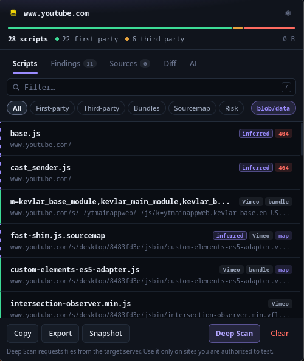
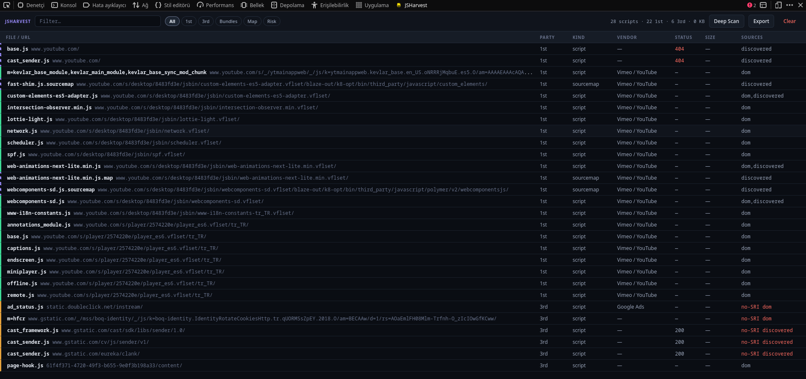
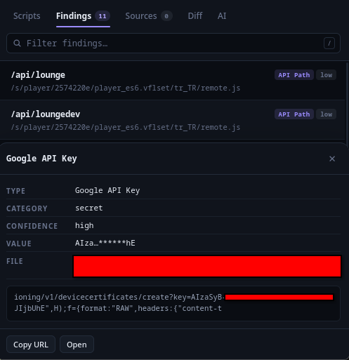

<div align="center">


# JSHarvest

**See every piece of JavaScript a page runs — and who it belongs to.**

A Manifest V3 extension that builds a deduplicated, classified inventory of every script a page loads, then digs deeper: hidden bundle chunks, recovered source trees, exposed keys, supply-chain risk.

[](LICENSE)
[](manifest.json)
[](#install)
[](#install)
[](package.json)
[](test/run.mjs)



</div>

---

## Why

Open DevTools on any real site and the Network tab drowns you. The same file appears three times, cache-busting query strings split identical resources apart, and nothing tells you whether a script is *yours* or a third party executing code on your page.

JSHarvest answers the question the Network tab does not: **what JavaScript is running here, where did it come from, and what should worry me about it.**

Collection is passive — it only observes what the browser already loads. The single feature that touches the target server, **Deep Scan**, is opt-in and clearly labelled.

## Features

### One deduplicated list, three capture layers

Everything merges on `origin + pathname`, so one file is one row no matter how many layers saw it.

| Layer | Catches |
|---|---|
| **Network** | `webRequest` for `script`, `xmlhttprequest`, `other` — lazy chunks included, detected by extension or `Content-Type` |
| **DOM** | `script[src]`, preloads, `modulepreload`, import maps, inline path references, `sourceMappingURL`, plus a `MutationObserver` for later additions |
| **Workers** | A page-context hook observing `Worker`, `SharedWorker` and `serviceWorker.register` — a class of script the other layers miss |

Each row records where it was seen: `network`, `dom`, `performance`, `discovered`.

### Classification and risk at a glance

The header carries a live **spectrum bar**: the page's JavaScript composition in a single strip. Colour carries meaning throughout the interface.

🟢 **first-party**  ·  🟠 **third-party**  ·  🔴 **risk**  ·  🟣 **inferred by JSHarvest**

Risk flags are real signals, not decoration — third-party scripts loaded **without Subresource Integrity**, **mixed content**, and failed or `4xx` responses.

### Deep Scan — what passive capture cannot see



Opt-in. Downloads first-party bundles and analyses them **as text** — no `eval`, and nothing fetched is ever executed.

- **Hidden chunks** — webpack chunk maps (including the Next.js `({…}[e]||e)` shape), Vite `__vite__mapDeps`, dynamic `import()`, `new URL(…, import.meta.url)` workers, SystemJS deps
- **Verification** — discovered URLs are probed with `HEAD`; a `200` promotes them from *inferred* to *confirmed*
- **Recursion** — discovered first-party chunks get scanned in turn
- **Source recovery** — `.map` files are parsed back into the original source tree, flagged when `sourcesContent` is embedded
- **Secret & endpoint mining** — API keys, tokens, private keys, JWTs, internal hosts, S3 buckets, API paths

### Findings, with secrets masked



Secret values are masked **everywhere** — the list, the detail panel, the surrounding code context, exports, and anything sent to an AI provider. A raw secret is never stored, so it can never leak.

### Diff, export, DevTools

- **Diff** — snapshot a page, browse or redeploy, then see exactly what was **added, removed or changed**
- **Export** — TXT · JSON · CSV · Markdown · **HAR** · **curl** probe script · **wordlist** for `ffuf`/`gobuster` · recovered source tree
- **DevTools panel** — a wider, sortable table for large sites

### AI analysis — bring your own key

Optional, off by default. **Setup is one field: paste an API key.** The provider is detected from its format and a model is chosen for you, falling back automatically if an id has been retired. You can **pin a specific model** in Options when it matters — leave the field empty to keep automatic selection. The provider and the model actually in use are always shown in the AI tab.

| Key prefix | Provider |
|---|---|
| `sk-ant-…` | Anthropic (Claude) |
| `sk-…` / `sk-proj-…` | OpenAI |
| `AIza…` | Google Gemini |
| `gsk_…` | Groq |
| `sk-or-v1-…` | OpenRouter |

One click produces an **attack-surface assessment**, **findings triage**, **third-party risk review**, **tech fingerprint** or **recon next steps** — then you can ask follow-ups. Answers stream in and render through a DOM-only Markdown renderer, so model output can never inject markup.

---

## Install

Both browsers share one codebase; only the `background` manifest key differs, so a copy-only build emits two packages.

```bash
git clone git@github.com:abdulhalimaltuntas/JSHarvest.git
cd JSHarvest
node build.mjs        # -> dist/chrome, dist/firefox
```

<details>
<summary><b>Chrome</b></summary>

1. Open `chrome://extensions`
2. Enable **Developer mode**
3. **Load unpacked** → select `dist/chrome` (the repo root works too)

</details>

<details>
<summary><b>Firefox</b></summary>

1. Open `about:debugging#/runtime/this-firefox`
2. **Load Temporary Add-on…** → select `dist/firefox/manifest.json`
3. **Required:** `about:addons` → JSHarvest → **Permissions** → enable *Access your data for all websites*.
   Firefox MV3 treats host permissions as optional; without this, `webRequest` never fires and the list stays empty.

Temporary add-ons are removed when Firefox restarts.

</details>

## Usage

| Action | Result |
|---|---|
| Click the toolbar icon | The tab's script inventory — the badge shows a live count |
| `/` | Focus the filter |
| Click a row | Detail panel with full metadata, copy and open |
| `Esc` | Close the panel, otherwise clear filters |
| `Ctrl`/`Cmd` + `C` | Copy the filtered list |

Views: **Scripts** · **Findings** · **Sources** · **Diff** · **AI**.
Filters: first-party, third-party, bundles, source maps, risk, plus a `blob:`/`data:` toggle.

> [!WARNING]
> Deep Scan requests files from the site you are inspecting, and mining can surface sensitive data. Use it only on sites you own or are authorized to test.

## Architecture

```
background/service-worker.js   webRequest listeners, navigation epochs, badge, router
content/collector.js           DOM layer, all frames
content/page-hook.js           page-context Worker / ServiceWorker observer
lib/
  browser-api.js               `browser` ?? `chrome` shim
  store.js                     storage.session, epoch model, quota handling
  classify.js                  normalization, dedupe key, party / vendor / risk
  deepscan.js                  chunk discovery, HEAD verification, recursion
  sourcemap.js   mine.js       source recovery · secret & endpoint mining
  diff.js        history.js    snapshots and comparison
  ai.js          markdown.js   AI layer · safe Markdown renderer
  export.js      settings.js   serializers · user options
popup/  panel/  options/       three UI surfaces, one token system
test/run.mjs                   36 tests, no dependencies
```

**Navigation epochs.** Every entry carries a navigation epoch. `onBeforeNavigate` bumps it without clearing the list; `onCommitted` purges only entries from the previous page. A script racing the commit already holds the new epoch, so it survives — while SPA route changes leave the list intact.

**Surviving suspension.** The MV3 service worker can be killed at any moment, so the in-memory map is only a cache. Every write goes to `storage.session`, batched with a 300 ms debounce and a 1 s ceiling; the worker rehydrates on wake.

**Cross-browser.** Every module imports `api` from `lib/browser-api.js` rather than touching `chrome.*` directly — Firefox's `chrome.*` alias is callback-based, so `await chrome.storage.session.get(…)` would silently resolve to `undefined` there.

**Persistence split.** Live capture lives in `storage.session` and clears with the browser. Settings and Diff snapshots live in `storage.local`.

## Privacy

Everything is processed **on your device**. No analytics, no telemetry, no account, no server operated by the developer — full policy in [PRIVACY.md](PRIVACY.md).

Two features reach the network, both off by default and both under your control: **Deep Scan** contacts only the site you are inspecting, and **AI analysis** contacts only the provider whose key you supplied. Raw secret values are never stored, so they can never be transmitted.

## Development

No dependencies are needed to build or test — plain ES modules and Node built-ins.

```bash
node test/run.mjs          # 36 unit tests
node build.mjs             # emit dist/chrome and dist/firefox
npm run lint:firefox       # web-ext lint (needs npm i)
npm run package:firefox    # store-ready zip
```

CI runs the tests, builds both targets, syntax-checks every module and lints the Firefox package on every push.

Every non-obvious decision is recorded in [DECISIONS.md](DECISIONS.md).

## Known limits

- `blob:` and `data:` scripts are opaque — recorded and grouped separately, but not attributable.
- The page-context worker hook is best-effort; a strict CSP can block it, and workers created before `document_idle` may be missed.
- Deep Scan results are inferences until `HEAD` verification confirms them; unusual or heavily obfuscated bundlers may yield nothing.
- Mining is heuristic. High-signal key formats are reliable; the generic `key=…` pattern is low-confidence by design.
- Firefox needs the host permission granted by hand, and temporary add-ons disappear on restart.

## License

[MIT](LICENSE) © 2026
